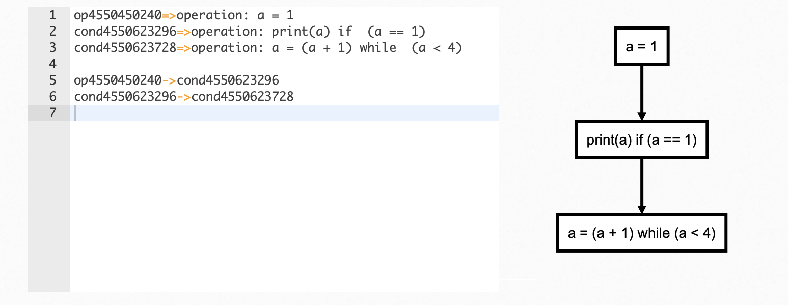
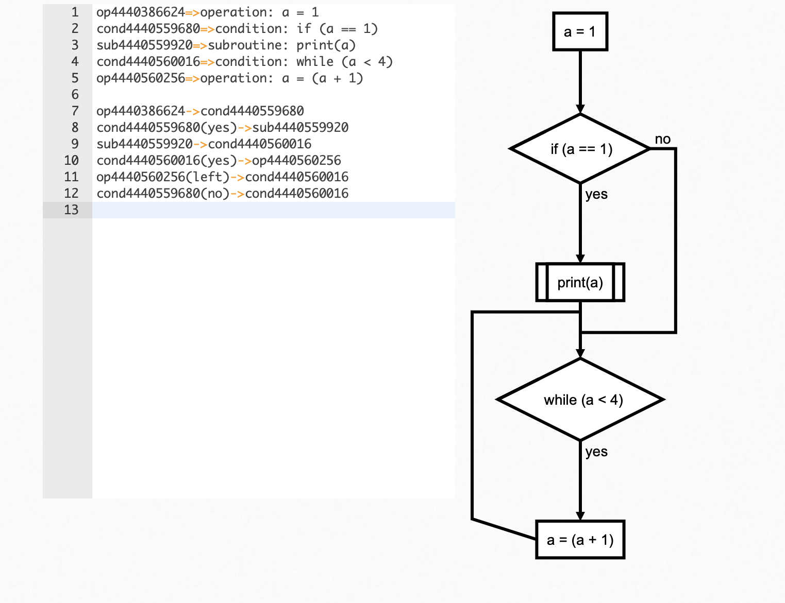

# PyFlowchart

PyFlowchart is a package to:

- write flowchart in Python,
- translate Python source codes into flowchart.

PyFlowchart produces flowcharts in [flowchart.js](https://github.com/adrai/flowchart.js) flowchart DSL, a widely used flow chart textual representation. It's easy to convert these flowcharts text into a picture via [flowchart.js.org](http://flowchart.js.org), [francoislaberge/diagrams](https://github.com/francoislaberge/diagrams/#flowchart), or some markdown editors. 

## Get PyFlowchart

```sh
$ pip3 install pyflowchart
```

## Quick Start

To flowchartlize your python codes in `example.py`，run:

```sh
$ python3 -m pyflowchart example.py
```

PyFlowchart will output the generated flowchart.js DSL. Go http://flowchart.js.org or use editors like [Typora](https://support.typora.io/Draw-Diagrams-With-Markdown/#flowcharts) to turns the output code into a rendered diagram.

To specify a function (or a method in a class) to flowchartlize:

```sh
$ python3 -m pyflowchart example.py -f function_name
# or
$ python3 -m pyflowchart example.py -f ClassName.method_name
```

## Flowchart in Python

PyFlowchart allows you to write a flowchart in Python which could be automatically translated into [flowchart.js](https://github.com/adrai/flowchart.js) flowchart DSL.

PyFlowchart supports [flowchart.js](https://github.com/adrai/flowchart.js#node-types) node types:

- StartNode
- OperationNode
- ConditionNode
- InputOutputNode
- SubroutineNode
- EndNode

Nodes can be connected by `connect()` method (`connect_{yes|no}` for ConditionNode).

Get a Flowchart with your start node and call its `flowchart()` method to generate flowchart.js flowchart DSL：

```python
from pyflowchart import *

st = StartNode('a_pyflow_test')
op = OperationNode('do something')
cond = ConditionNode('Yes or No?')
io = InputOutputNode(InputOutputNode.OUTPUT, 'something...')
sub = SubroutineNode('A Subroutine')
e = EndNode('a_pyflow_test')

# define the direction the connection will leave the node from
sub.set_connect_direction("right")
    
st.connect(op)
op.connect(cond)
cond.connect_yes(io)
cond.connect_no(sub)
sub.connect(op)
io.connect(e)
 
fc = Flowchart(st)
print(fc.flowchart())
```

Output:

```
st4471442960=>start: start a_pyflow_test
op4471442064=>operation: do something
cond4471501392=>condition: Yes or No?
io4471501648=>inputoutput: output: something...
e4471501904=>end: end a_pyflow_test
sub4471501584=>subroutine: A Subroutine

st4471442960->op4471442064
op4471442064->cond4471501392
cond4471501392(yes)->io4471501648
io4471501648->e4471501904
cond4471501392(no)->sub4471501584
sub4471501584(right)->op4471442064
```

Then you can visit http://flowchart.js.org and translate the generated textual representation into SVG flow chart diagrams:


P.S. Many Markdown editors (for example, Typora) support this flowchart syntax, too (refer [Typora doc about flowchart](https://support.typora.io/Draw-Diagrams-With-Markdown/#flowcharts)). And if you prefer CLI, see [francoislaberge/diagrams](https://github.com/francoislaberge/diagrams/#flowchart).

## Python to Flowchart

PyFlowchart can also translate your Python Codes into Flowcharts.

For example, you got a `simple.py`:

```python
def foo(a, b):
    if a:
        print("a")
    else:
        for i in range(3):
            print("b")
    return a + b
```

Run PyFlowchart in CLI to generate flowchart code:

```sh
$ python3 -m pyflowchart simple.py

# output flowchart code.
```

Or, in Python

```python
>>> from pyflowchart import Flowchart
>>> with open('simple.py') as f:
...     code = f.read()
... 
>>> fc = Flowchart.from_code(code)
>>> print(fc.flowchart())

# output flowchart code.
```


## Advanced Usages

As mentioned above, we use `Flowchart.from_code` to translate Python code into Flowchart. The `from_code` is defined as:

```python
Flowchart.from_code(code, field='', inner=True, simplify=True)
```

PyFlowchart CLI is a 1:1 interface for this function:

```sh
python3 -m pyflowchart [-f FIELD] [-i] [--no-simplify] code_file
```

Let's talk about those three args:

- `field`: str: Specify a field of code to generate flowchart
- `inner`: bool:  `True` to parse the body of field; whereas `False` to parse the body as an single object.
- `simplify`: bool: for If & Loop statements: simplify the one-line-body or not

### field

`field` is the path to a field (i.e. a function) you want to draw flowchart. 

```python
# example.py
print("start")

def foo():
    foo = "foo"

class Bar():
    def buzz(self, f):
        def g(self):
            print("g")
            f(self)
        return g(self)

Bar().buzz(foo)
print("end")
```

For `example.py` above, available paths are:

    - "" (means the whole code)
    - "foo"
    - "Bar.buzz"
    - "Bar.buzz.g"

To generate a flowchart of `Bar.buzz.g`：

```python
# Python
from pyflowchart import Flowchart
with open('example.py') as f:
	code = f.read()
fc = Flowchart.from_code(code, field='Bar.buzz.g', inner=False)
print(fc.flowchart())
```

```sh
# CLI
python3 -m pyflowchart example.py -f Bar.buzz.g
```

Output result:


### inner

`inner` controls parser's behaves. Techly, `inner=True` means parsing `field.body`, while `inner=False` parses `[field]`. So, if  `inner=True`, pyflowchart will look into the field, otherwise  it takes field as a node.


For CLI,  adding an argument `-i`  means `inner=True`, else `inner=False`.

### simplify

simplify is for If & Loop statements: simplify the one-line-body.

For example:

```python
# example_simplify.py
a = 1
if a == 1:
    print(a)
while a < 4:
    a = a + 1
```

- Default: `simplify=True`:

```python
flowchart = Flowchart.from_code(example_simplify_py, field="", inner=True)
print(flowchart.flowchart())
# CLI $ p3 -m pyflowchart example_simplify.py 
```



- `simplify=False`:

```python
flowchart = Flowchart.from_code(example_simplify_py, field="", inner=True, simplify=False)
print(flowchart.flowchart())
# CLI $ p3 -m pyflowchart --no-simplify example_simplify.py 
```



## Beautify Flowcharts

Sometimes, the generated flowchart is awful. In that case, you are encouraged to modify the generated flowchart code by yourself OR consider making your python source code at bottom more clear if it's exceedingly complex.

## TODO

- [ ] Directly generate flowchart SVG/HTML:

```sh
$ pyflowchart example.py -o flowchart.svg
```

Depends node.js and flowchart.js.

- [ ] PyFlowchart GUI

Well, I guess a **GUI** for PyFlowchart may be remarkable. Pasting your code into it, the flowchart DSL will be generated just in time, and flowchart will be shown aside.

- [ ] ~~The Chinese README your buddies waiting for!~~ 希望有大佬帮助贡献个中文 README 呀。

----

Sadly, I am too busy (pronounced as `[ˈlеizi]`——lazy) to code these ideas. Please [submit an issue](https://github.com/cdfmlr/pyflowchart/issues/new) to push me on. Or, PR to make it by yourself. I cannot wait to appreciate your great contribution!

## References

- Inspired by [Vatsha/code_to_flowchart](https://github.com/Vatsha/code_to_flowchart)
- Based on [adrai/flowchart.js](http://flowchart.js.org), [python ast](https://docs.python.org/3/library/ast.html), [simonpercivall/astunparse](https://github.com/simonpercivall/astunparse)
- [A blog about this project](https://clownote.github.io/2020/10/24/blog/PyFlowchart/)

## License

Copyright 2020 CDFMLR. All rights reserved.

Licensed under the MIT License.

