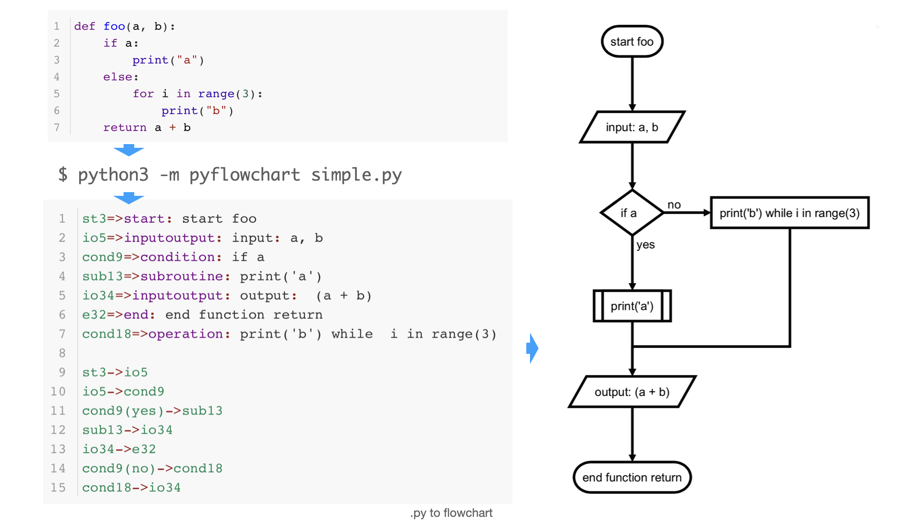
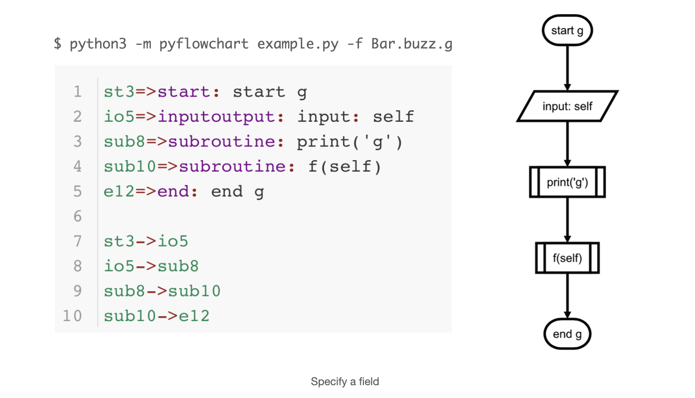
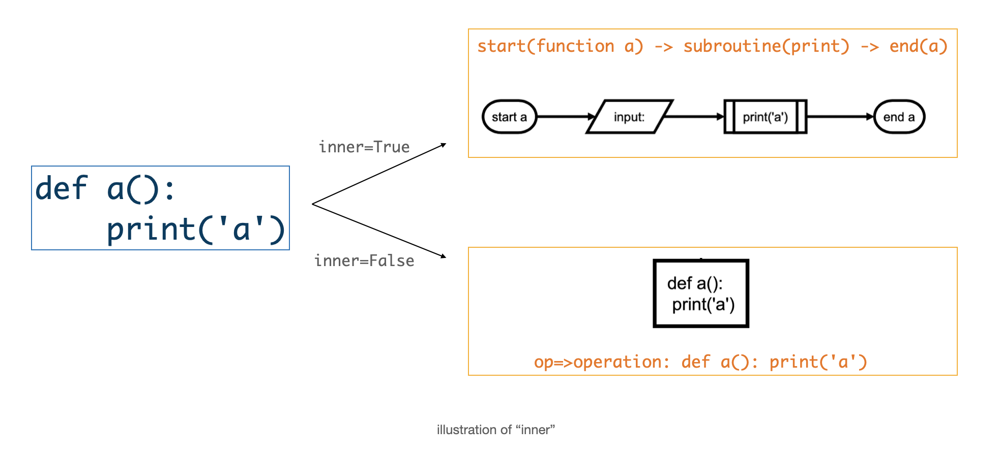
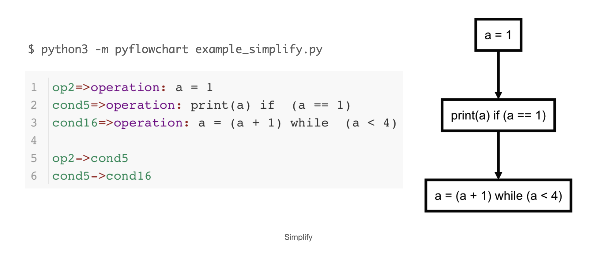
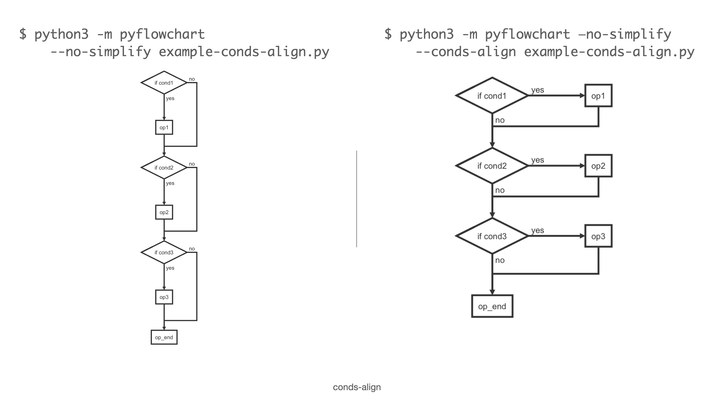
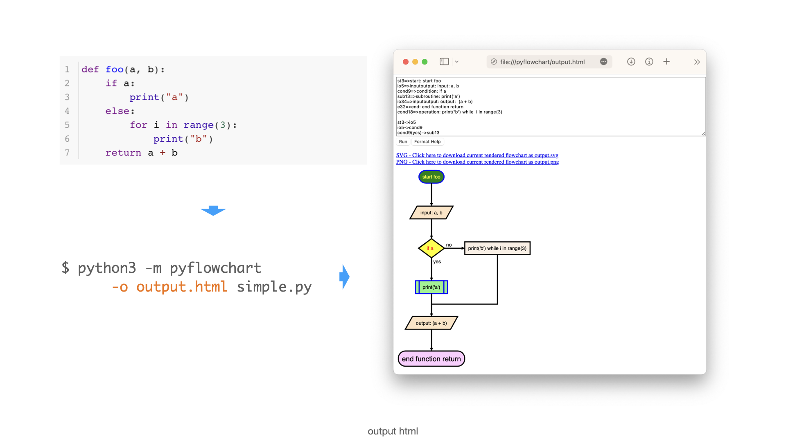
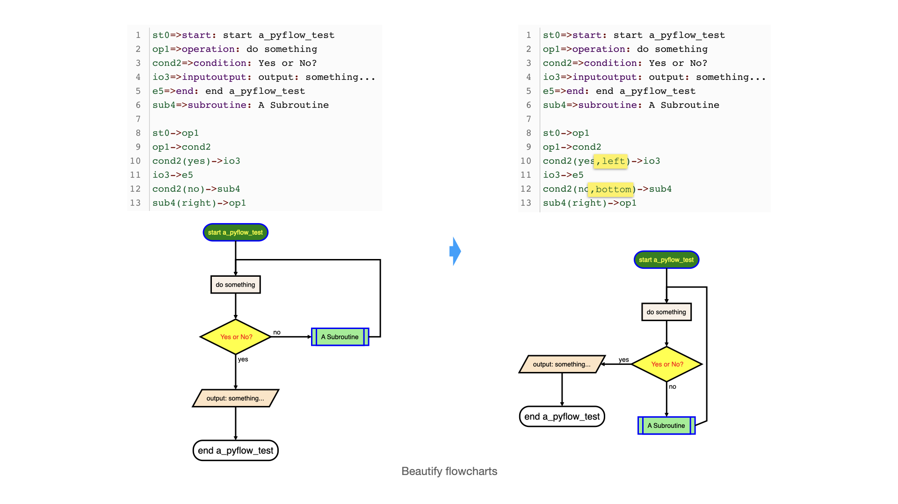

# PyFlowchart

English | [机翻中文](README_zh-CN.md)

PyFlowchart is a Python package that lets you:

- Write flowcharts in Python.
- Translate Python source code into flowcharts.

PyFlowchart produces flowcharts in the [flowchart.js](https://github.com/adrai/flowchart.js)  flowchart DSL, a widely used textual representation of flowcharts. You can convert these flowcharts to images using [flowchart.js.org](http://flowchart.js.org), [francoislaberge/diagrams](https://github.com/francoislaberge/diagrams/#flowchart), or some markdown editors. Alternatively, we  also support an option to output the generated flowchart into a interactive HTML page.

## Get PyFlowchart

```sh
$ pip install pyflowchart
```

## Quick Start

Want to **flowchart your Python code in `example.py`?** Run this:

```sh
$ python -m pyflowchart example.py
```

> ⚠️ PyFlowchart works with **Python 3.7+**. To check your Python version, run [`python --version`](https://docs.python.org/3/using/cmdline.html#cmdoption-version).
>
> If you have both Python 2 and Python 3 installed, you may need to use `python3` instead of `python`. This is becoming less common as [Python 2 is sunsetting](https://www.python.org/doc/sunset-python-2/).

PyFlowchart will output the generated flowchart.js DSL. You can convert the output code to a rendered diagram by going to http://flowchart.js.org or using editors like Typora.

**To output a HTML file** containing the generated flowchart:

```sh
$ python -m pyflowchart example.py -o example.html
$ # open example.html
```

Open `example.html` in your browser to see the output in graphical representation.

**To specify a function (or a method in a class) to flowchartlize:**

- Use the `-f` flag to specify the function or method name.

```sh
$ python -m pyflowchart example.py -f function_name
# or
$ python -m pyflowchart example.py -f ClassName.method_name
```

For example, to flowchartlize the `add()` function in the `MyClass` class, you would use the following command: `python3 -m pyflowchart example.py -f MyClass.add`.

🎉 **Now you are ready to flowchart your code!**

To learn more about how to use PyFlowchart, keep reading this document.

## Flowchart in Python

PyFlowchart lets you write flowcharts in Python, which can be automatically translated into the [flowchart.js](https://github.com/adrai/flowchart.js) DSL.

The following [flowchart.js node types](https://github.com/adrai/flowchart.js#node-types) are supported:

- StartNode
- OperationNode
- ConditionNode
- InputOutputNode
- SubroutineNode
- EndNode

To connect nodes, use the `connect()` method. For ConditionNodes, use the `connect_{yes|no}` syntax. You can optionally specify the connect_direction as a second parameter.

Get a Flowchart with your start node and call its `flowchart()` method to generate flowchart.js flowchart DSL：

```python
from pyflowchart import *

st = StartNode('a_pyflow_test')
op = OperationNode('do something')
cond = ConditionNode('Yes or No?')
io = InputOutputNode(InputOutputNode.OUTPUT, 'something...')
sub = SubroutineNode('A Subroutine')
e = EndNode('a_pyflow_test')

st.connect(op)
op.connect(cond)
cond.connect_yes(io)
cond.connect_no(sub)
sub.connect(op, "right")  # sub->op line starts from the right of sub
io.connect(e)
 
fc = Flowchart(st)
print(fc.flowchart())
```

Output:

```
st0=>start: start a_pyflow_test
op1=>operation: do something
cond2=>condition: Yes or No?
io3=>inputoutput: output: something...
e5=>end: end a_pyflow_test
sub4=>subroutine: A Subroutine

st0->op1
op1->cond2
cond2->
cond2->
cond2(yes)->io3
io3->e5
cond2(no)->sub4
sub4(right)->op1
```

You can visit http://flowchart.js.org and translate the generated textual representation into SVG flow chart diagrams:


(v0.3.0) You can also use `pyflowchart.output_html` to generate a page similar to the picture above:

```python
output_html('output.html', 'a_pyflow_test', fc.flowchart())
```

By the way, many Markdown editors, like Typora, also support this flowchart syntax. For more information, see [the Typora documentation on flowcharts]((https://support.typora.io/Draw-Diagrams-With-Markdown/#flowcharts)). If you prefer the command line, you can use [francoislaberge/diagrams]((https://github.com/francoislaberge/diagrams/#flowchart)).

### Set Params to Nodes

Starting with v0.2.0, you can use the `Node.set_param(key, value)` method to generate flowcharts like this:

```
element(param1=value1,param2=value2)=>start: Start
```

(See also [adrai/flowchart.js#node-specific-specifiers-by-type](https://github.com/adrai/flowchart.js#node-specific-specifiers-by-type))

There is also a shortcut to set the `align-next=no` parameter for ConditionNodes: 

```python
cond = ConditionNode("a cond node")
cond.no_align_next()
# or do this at __init__:
cond = ConditionNode("a cond node", align_next=False)
```

This usually works with a connect_direction customization:

```python
cond.connect_yes(op, "right")
```

The generated flowchart will look like:

```
cond(align-next=no)=>condition: Yes or No?
...
cond(yes,right)->op
```

## Python to Flowchart

PyFlowchart can also translate your Python code into flowcharts.

For example, let's say you have a Python file called `simple.py` with the following code:

```python
def foo(a, b):
    if a:
        print("a")
    else:
        for i in range(3):
            print("b")
    return a + b
```

To generate a flowchart from this code, you can run the following command in the terminal:

```sh
$ python -m pyflowchart simple.py

# output flowchart code.
```

Or, in Python:

```python
>>> from pyflowchart import Flowchart
>>> with open('simple.py') as f:
...     code = f.read()
... 
>>> fc = Flowchart.from_code(code)
>>> print(fc.flowchart())

# output flowchart code.
```



## Advanced Usages

As mentioned above, we use `Flowchart.from_code` to translate Python codes into Flowcharts. The `from_code` is defined as:

```python
Flowchart.from_code(code, field="", inner=True, simplify=True, conds_align=False)
```

- `code`: The Python code to be converted into a flowchart.
- `field`: The name of a field in the code to be converted into a flowchart. If this parameter is not specified, the entire code will be converted.
- `inner`: If `True`, the body of the field will be parsed as a nested flowchart. If `False`, the body of the field will be parsed as a single node.
- `simplify`: If `True`, simple If and Loop statements will be simplified. For example, an If statement with a single expression will be converted into a single node.
- `conds_align`: If `True`, consecutive If statements will be aligned in the flowchart.

PyFlowchart CLI is an interface for this function:

```sh
python -m pyflowchart [-f FIELD] [-i] [--no-simplify] [--conds-align] [-o OUTPUT] code_file
```

- `-f FIELD`: The name of the field to be converted into a flowchart.
- `-i`:  If specified, the body of the field will be parsed as a nested flowchart.
- `--no-simplify`:  If specified, the If and Loop statements will not be simplified.
- `--conds-align`: If specified, consecutive If statements will be aligned in the flowchart.
- `-o OUTPUT`: If specified, output the flowchart to specific file with a format indicating by the extension name. (only support `*.html` for now)

⚠️ `-o` is not a part of `Flowchart.from_code`. It's `from pyflowchar import output_html`.

### field

the `field` is the path to a field (i.e. a function) you want to draw a flowchart. 

```python
# example.py
print("start")

def foo():
    foo = "foo"

class Bar():
    def buzz(self, f):
        def g(self):
            print("g")
            f(self)
        return g(self)

Bar().buzz(foo)
print("end")
```

For `example.py` above, available paths are:

    - "" (means the whole code)
    - "foo"
    - "Bar.buzz"
    - "Bar.buzz.g"

To generate a flowchart of `Bar.buzz.g`：

```python
# Python
from pyflowchart import Flowchart
with open('example.py') as f:
	code = f.read()
fc = Flowchart.from_code(code, field='Bar.buzz.g', inner=False)
print(fc.flowchart())
```

Or:

```sh
# CLI
python -m pyflowchart example.py -f Bar.buzz.g
```

Output result:



### inner

The `inner` parameter controls how the parser behaves. If `inner=True`, the parser will look into the field and parse its body. If `inner=False`, the parser will take the field as a single node.



In CLI, the `-i` argument sets `inner=True`. The absence of `-i` argument implies `inner=False`.

🔧 For developers: Techly, `inner=True` means parsing `field.body`, while `inner=False` parses `[field]`.

### simplify

The `simplify` parameter controls whether to simplify If and Loop statements. When `simplify=True`, an If or Loop statements with one-line-body will be simplified into a single node.

For example, the following code:

```python
# example_simplify.py
a = 1
if a == 1:
    print(a)
while a < 4:
    a = a + 1
```

Would be converted into the following flowchart when **simplify=True** :

```python
flowchart = Flowchart.from_code(example_simplify_py, field="", inner=True)
print(flowchart.flowchart())
# SH $ python -m pyflowchart example_simplify.py 
```



And with `simplify=False`:

```python
flowchart = Flowchart.from_code(example_simplify_py, field="", inner=True, simplify=False)
print(flowchart.flowchart())
# SH $ python -m pyflowchart --no-simplify example_simplify.py 
```


### conds-align (Beta)

The `conds-align` parameter controls whether consecutive If statements are aligned in the flowchart. When `conds-align=True`, consecutive If statements are aligned in the flowchart.

```python
# example-conds-align.py
if cond1:
	op1
if cond2:
	op2
if cond3:
	op3
op_end
```



**Note:** This feature is still in beta and may not work perfectly in all cases.

### output html and images

You can also directly ouput the generated flowchart.js DSL into an html by adding the parameter ```-o output.html``` where you specify an output filename ending in `.html` or `.htm`.



Opening the `output.html` in your browser will let you visualize the diagrams. You can tweak the code and click run to update the diagram. There are also links to download the current visuals as a  `.svg` or `.png` image.

⚠️ The output file specified will overwrite any file that already has that name.

🐍 To use this feature via Python instead of CLI, call `output_html(output_name: str, field_name: str, flowchart: str) -> None`:

```py
>>> import pyflowchart
>>> help(pyflowchart.output_html)
```

## Beautify Flowcharts

The flowcharts generated by PyFlowchart may not always be perfect. In these cases, you can modify the generated flowchart code yourself or consider making your Python source code more clear. Clear and beautiful Python source code will result in more beautiful flowcharts generated by PyFlowchart.

An example: If you don't like the flowchart flow direction you can tweak a condition by modifying with with directions such as:



## TODOs

- [ ] Directly generate flowchart SVG/HTML:

```sh
$ pyflowchart example.py -o flowchart.svg
```

Depends on `node.js` and `flowchart.js`.

- [ ] PyFlowchart GUI

A **GUI** for PyFlowchart would be amazing. You could paste your Python code into it, and the flowchart DSL would be generated in real time, with the flowchart displayed alongside it. You could clearly see how the two are related.

- [ ] ~~The Chinese README your buddies waiting for!~~ 希望有同学帮助贡献个中文 README 呀。
- [x] Tests automation.

----

Unfortunately, I am too busy (pronounced as `[ˈlеizi]`——lazy) to code these ideas myself. Please [submit an issue](https://github.com/cdfmlr/pyflowchart/issues/new) to push me on. Or, PR to make it by yourself. I cannot wait to appreciate your great contribution!

## References

- Inspired by [Vatsha/code_to_flowchart](https://github.com/Vatsha/code_to_flowchart)
- Based on [adrai/flowchart.js](http://flowchart.js.org), [python ast](https://docs.python.org/3/library/ast.html), [simonpercivall/astunparse](https://github.com/simonpercivall/astunparse)
- [A blog about this project](https://clownote.github.io/2020/10/24/blog/PyFlowchart/)

## License

Copyright 2020-2023 CDFMLR. All rights reserved.

Licensed under the MIT License.

